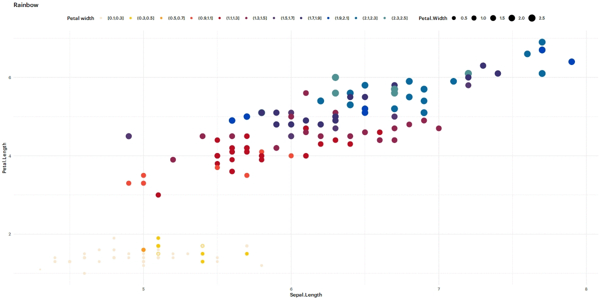
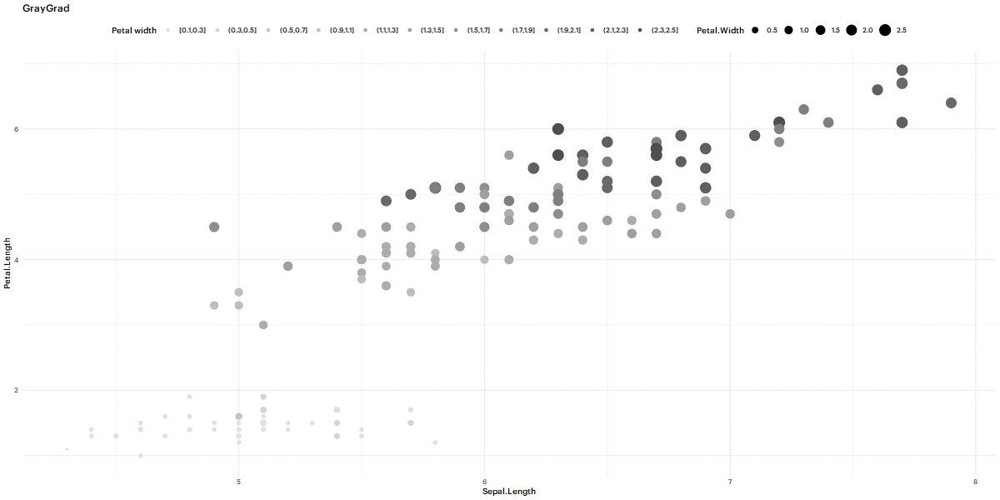
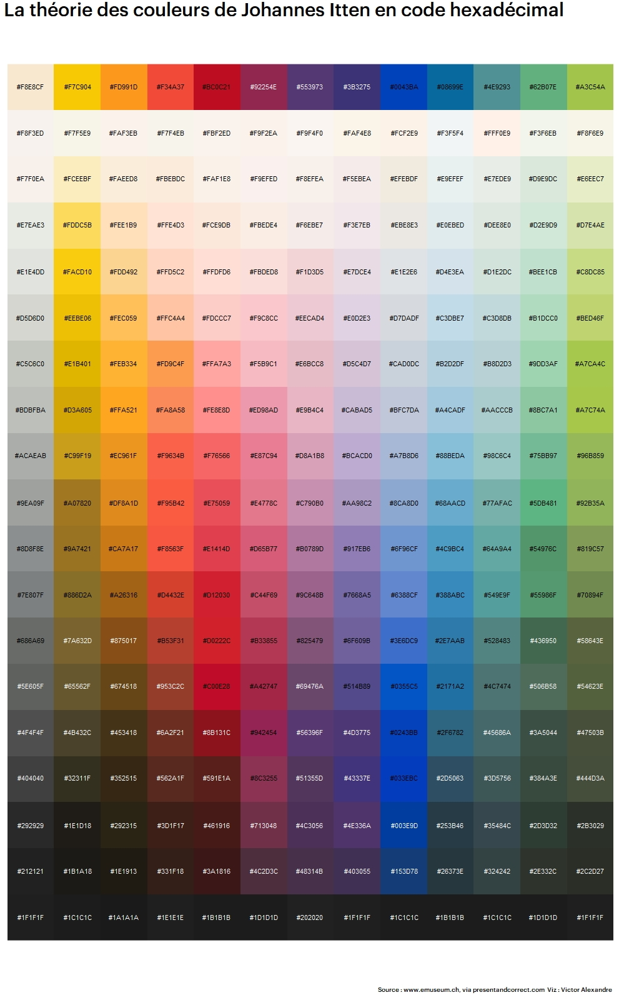

# ColorPalettes
Color palettes created from famous paintings, for R.

## About this project
Creating colour palettes usable with R, based on paintings. Yes. That's even more color palettes on top of all the existing ones. Sorry.


## Usage

If you came here for the Van Itten color theory palettes, you can copy this link to your script and call one of these vectors :

```
source("https://raw.githubusercontent.com/Valexandre/ColorPalettes/master/JohannesItten.R")
iris%>%ggplot()+
             geom_point(aes(Sepal.Length,
                            Petal.Length,
                            colour=cut(iris$Petal.Width,breaks =seq(from=min(iris$Petal.Width),
                            to=max(iris$Petal.Width),length.out =13),
                            include.lowest = T),
                            size=Petal.Width))+
             labs(title="Rainbow_7")+
             scale_colour_manual("Petal width",values=Rainbow_7)+
             guides(colour=guide_legend(nrow=1,byrow=TRUE))+
             theme_minimal()
```

* Rainbow
* Rainbow_1
* Rainbow_2
* Rainbow_3
* Rainbow_4
* Rainbow_5
* Rainbow_6
* Rainbow_7



* DarkBlueGrad
* LightBlueGrad
* OrangeGrad
* YellowGrad
* RaspGrad
* RedGrad
* PinkGrad
* PlumGrad
* PurpleGrad
* RiverGreenGrad
* GrassGreenGrad
* TurquoiseGrad
* GrayGrad






By making a link to the [List.R](https://github.com/Valexandre/ColorPalettes/blob/master/List.R) file to your script, you will get all the palettes listed in this file, and use them as you would with any other colour palette.

```
source("https://raw.githubusercontent.com/Valexandre/ColorPalettes/master/List.R")
ggplot(swiss)+
  geom_point(aes(Fertility,Agriculture,colour=rownames(swiss),size=Examination))+
  scale_colour_manual(values=rep(Monet_Poppies,5))+theme_minimal()
```

## Usage for the other paintings

* Monet - The Poppies. [Source](https://artsandculture.google.com/asset/poppy-field/xQGTinA-MPxcVg?hl=fr)

Name of the palette : Monet_Poppies


* Degas - Ballet rehearsal on stage . [Source](https://www.musee-orsay.fr/en/collections/works-in-focus/search.html?no_cache=1&zoom=1&tx_damzoom_pi1%5BshowUid%5D=119063)

Name of the palette : Degas_Ballet


* Monet - La Gare Saint-Lazare . [Source](https://art.rmngp.fr/fr/library/artworks/claude-monet_la-gare-saint-lazare_huile-sur-toile_1877/download/145935)

Names of the palettes : Monet_Lazare1 & Monet_Lazare2

