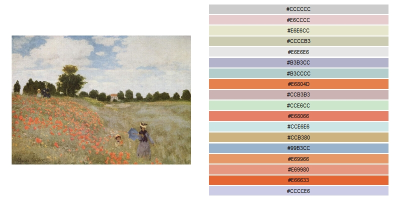
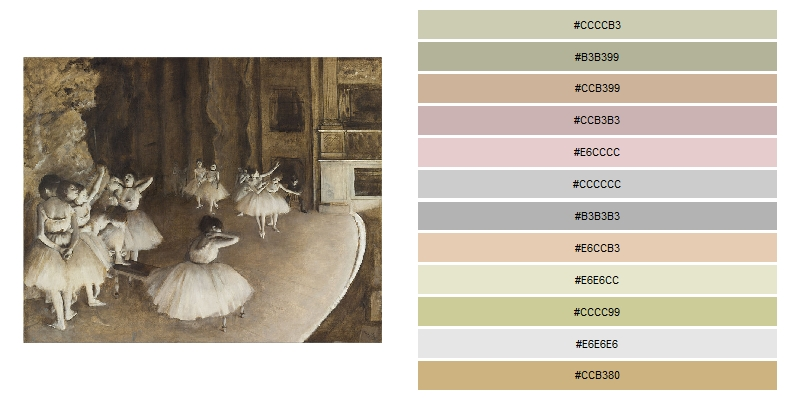

# ColorPalettes
Color palettes created from famous paintings, for R.

## About this project
Creating colour palettes usable with R, based on paintings. Yes. That's even more color palettes on top of all the existing ones. Sorry.

## Usage
By making a link to the [List.R](https://github.com/Valexandre/ColorPalettes/blob/master/List.R) file to your script, you will get all the palettes listed in this file, and use them as you would with any other colour palette.

```
source("https://raw.githubusercontent.com/Valexandre/ColorPalettes/master/List.R")
ggplot(swiss)+
  geom_point(aes(Fertility,Agriculture,colour=rownames(swiss),size=Examination))+
  scale_colour_manual(values=rep(Monet_Poppies,5))+theme_minimal()
```


* Monet - The Poppies. [Source](https://artsandculture.google.com/asset/poppy-field/xQGTinA-MPxcVg?hl=fr)

Name of the palette : Monet_Poppies



* Degas - Ballet rehearsal on stage . [Source](https://www.musee-orsay.fr/en/collections/works-in-focus/search.html?no_cache=1&zoom=1&tx_damzoom_pi1%5BshowUid%5D=119063)

Name of the palette : Degas_Ballet

